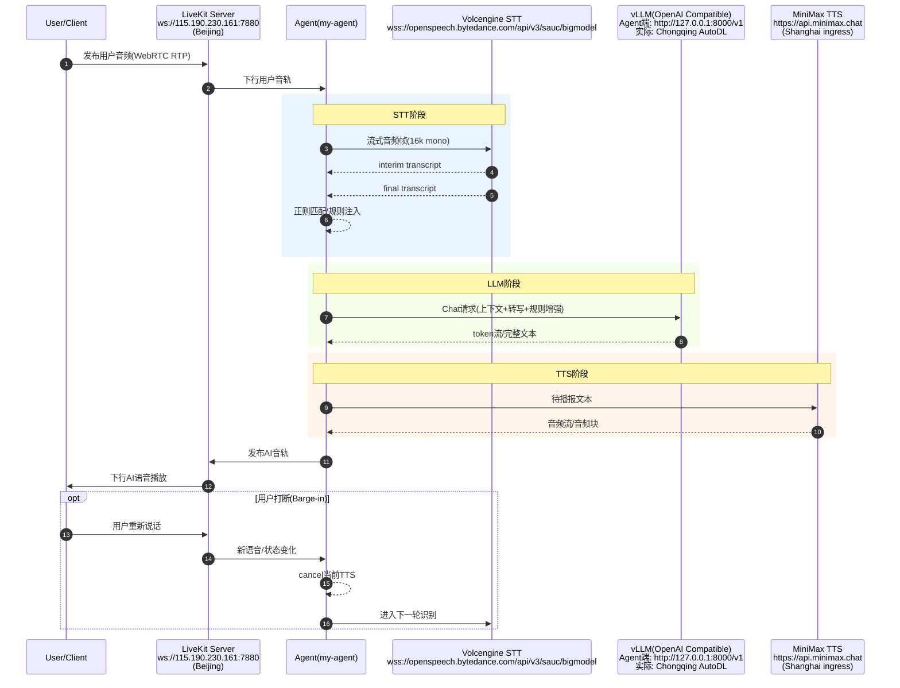
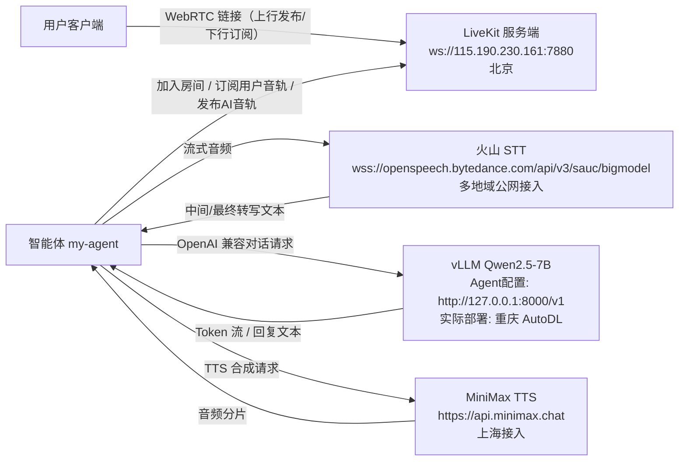

# LiveKit Demo 时序、架构与基础概念（含服务地址）

本文基于当前 `my-agent` 实际配置整理，包含：

- 当前服务地址与部署位置
- 端到端时序图（Mermaid）
- LiveKit 核心概念与基础理论（Room 等）
- `AgentSession(...)` 参数对应的已做优化与作用阶段

## 1. 当前服务地址与部署位置

1. LiveKit Server  
地址：`ws://115.190.230.161:7880`  
位置：北京

2. LLM Service（vLLM，OpenAI Compatible）  
Agent 侧配置地址：`http://127.0.0.1:8000/v1`  
实际部署位置：重庆 AutoDL  
说明：`127.0.0.1` 一般是通过端口映射/隧道转发到远端重庆机器。

3. STT Service（Volcengine BigModelSTT）  
接入地址：`wss://openspeech.bytedance.com/api/v3/sauc/bigmodel`  
位置：字节公网接入（多地域调度，非单一固定机房）

4. TTS Service（MiniMax）  
接入地址：`https://api.minimax.chat`  
解析链路含 `cn-shanghai` ALB，位置可视为上海接入

## 2. 端到端时序图（Mermaid）



## 2.1 部署拓扑图（Mermaid）



## 3. LiveKit 核心概念与基础理论（基于官方文档）

### 3.1 Room（房间）

Room 是会话容器。所有实时媒体交换都发生在同一个房间内。  
你的当前流程里：用户客户端和 `my-agent` 都连接同一 Room，通过 LiveKit Server 转发音频。

### 3.2 Participant（参与者）

Participant 是房间中的实体连接，可以是：

- 人类客户端
- 机器人/Agent

`my-agent` 本质上也是 Participant，不是旁路服务。它和用户一样加入房间、订阅轨道、发布轨道。

### 3.3 Track（轨道）

Track 是媒体流，常见有 Audio Track / Video Track。  
在本 Demo 中核心是 Audio Track：

- 用户发布上行音轨
- Agent 订阅用户音轨做 STT/LLM/TTS
- Agent 再发布 AI 音轨回房间

### 3.4 Track Publication 与 Subscription（发布与订阅）

- Publication：某个 participant 在房间里发布自己的 track
- Subscription：另一个 participant 订阅该 track

对应你的链路：

1. 用户 publication（麦克风音轨）  
2. Agent subscription（拿用户音轨）  
3. Agent publication（AI 语音音轨）  
4. 用户 subscription（听到 AI 语音）

### 3.5 LiveKit Server 与 Agent 的关系

1. LiveKit Server 是媒体与信令层（SFU）
- 负责房间管理、信令、媒体转发
- 不负责 STT/LLM/TTS 推理

2. Agent 是业务推理层
- 在房间中作为 participant 运行
- 订阅媒体后调用外部 AI 服务
- 再将结果以音轨形式发布回 LiveKit

一句话：  
LiveKit Server 是“实时媒体交换机”，Agent 是“挂在交换机上的 AI 座席”。

### 3.6 为什么会有端到端延迟

端到端延迟不是单点，近似由以下部分组成：

`Client<->LiveKit 媒体RTT + STT + LLM + TTS + Agent调度开销`

因此即使 LiveKit 很近，如果 STT/LLM/TTS 分散在不同地域，总体延迟仍会升高。

## 4. 当前已做优化（对应 AgentSession 参数）

下面对应你当前的核心配置：

```python
session = AgentSession(
    stt=volcengine.BigModelSTT(...),
    llm=openai.LLM(model="./qwen", base_url="http://127.0.0.1:8000/v1", ...),
    tts=minimax.TTS(model="speech-02-turbo", speed=1.05, ...),
    preemptive_generation=True,
    min_interruption_duration=0.2,
    min_endpointing_delay=0.0,
    max_endpointing_delay=0.05,
    turn_detection="stt",
)
```

### 4.1 STT 侧（用户语音 -> 文本）

1. `enable_itn=False`  
关闭 ITN 文本规范化，减少后处理耗时，换取更快返回。

2. `enable_punc=False`  
关闭标点恢复，减少后处理链路和等待。

3. `enable_ddc=False`  
关闭语义顺滑重写，降低后处理开销。

4. `vad_segment_duration=1200`  
缩短分段窗口，促使更早形成提交片段。

5. `end_window_size=240`  
缩短静音判停窗口，更快进入“说完”状态（但会提升误切句风险）。

6. `force_to_speech_time=1000`  
限制等待时间，避免长尾拖延。

7. `interim_results=True`  
开启中间转写，便于更早显示和更早进入后续流程。

### 4.2 LLM 侧（文本 -> 回复）

1. 使用 vLLM 私有端点（OpenAI Compatible）  
减少公网 SaaS 波动，降低 TTFT 抖动。

2. `Qwen2.5-7B`（当前模型）  
在效果与时延间做平衡；去冷启动后 TTFT 已进入较低区间。

### 4.3 TTS 侧（回复 -> 音频）

1. `model="speech-02-turbo"`  
选择低延迟模型，降低首包时间（TTFB）。

2. `base_url="https://api.minimax.chat"`  
使用国内接入域名，降低跨境不确定性。

3. `speed=1.05`  
略提高语速，缩短总播放时长（主要影响总时长，不是首包）。

### 4.4 会话编排侧（跨 STT/LLM/TTS）

1. `preemptive_generation=True`  
尽早开始生成，减少等待空窗。

2. `turn_detection="stt"`  
以 STT 事件做轮次边界，避免多套判定叠加。

3. `min_endpointing_delay=0.0` + `max_endpointing_delay=0.05`  
将额外端点等待压到接近 0。

4. `min_interruption_duration=0.2`  
200ms 即允许打断，提升交互灵敏度。

## 5. 优化项与阶段映射（速查）

1. User -> STT  
`vad_segment_duration / end_window_size / force_to_speech_time / interim_results`

2. STT 后处理  
`enable_itn / enable_punc / enable_ddc`（当前均关闭以换低时延）

3. STT -> LLM  
`turn_detection="stt"` + `preemptive_generation=True`

4. LLM 推理  
`vLLM + Qwen2.5-7B`

5. LLM -> TTS  
`speech-02-turbo` + `speed=1.05`

6. 播放与交互  
`min_interruption_duration=0.2` + `endpointing_delay` 参数

## 6. 参考（LiveKit 官方文档）

- https://docs.livekit.io/
- https://docs.livekit.io/home/get-started/core-concepts/
- https://docs.livekit.io/home/client/tracks/
- https://docs.livekit.io/home/server/generating-tokens/
