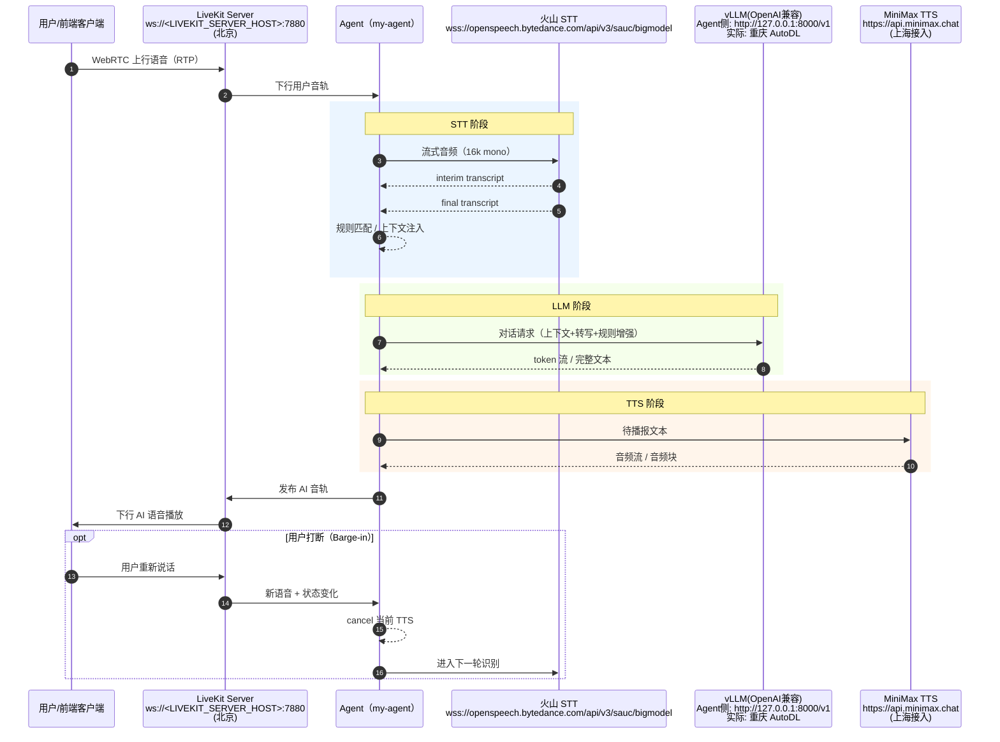
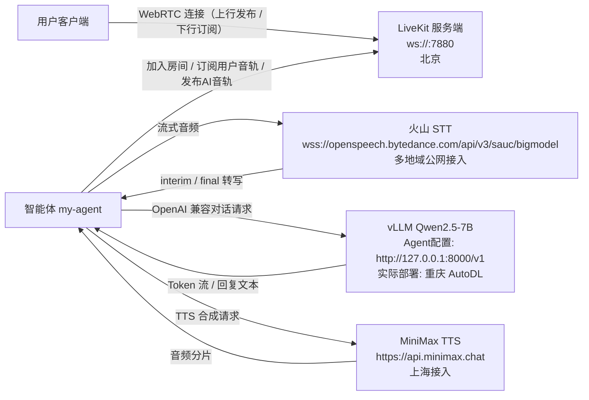

# 📡 LiveKit 语音链路数据流说明（架构 / 时序 / 核心概念）

> **📌 文档目标**：基于当前 `my-agent` 的真实配置，整理端到端数据流、服务位置、关键时延路径，以及 `AgentSession(...)` 参数对应的优化点，便于联调和排障。

---

## 1️⃣ 服务拓扑与地址

### 1.1 🌐 当前服务位置

1. **LiveKit Server**
- 地址：`ws://<LIVEKIT_SERVER_HOST>:7880`
- 位置：北京

2. **LLM Service（vLLM / OpenAI Compatible）**
- Agent 配置地址：`http://127.0.0.1:8000/v1`
- 实际部署位置：重庆 AutoDL
- 说明：`127.0.0.1` 一般通过 SSH 端口转发映射到远端服务

3. **STT Service（Volcengine BigModelSTT）**
- 接入地址：`wss://openspeech.bytedance.com/api/v3/sauc/bigmodel`
- 位置：字节公网多地域接入（非单固定机房）

4. **TTS Service（MiniMax）**
- 接入地址：`https://api.minimax.chat`
- 网络入口：解析链路为 `cn-shanghai` 方向（可视作上海接入）

---

## 2️⃣ 端到端时序图（Mermaid）



---

## 3️⃣ 部署拓扑图（Mermaid）



---

## 4️⃣ LiveKit 核心概念（与当前项目映射）

### 4.1 🏠 Room（房间）

Room 是会话容器。所有实时媒体交换都在同一房间内完成。  
在当前链路里：前端用户与 `my-agent` 同时加入同一个 Room，由 LiveKit 负责媒体转发。

### 4.2 👥 Participant（参与者）

Participant 是房间中的连接实体，可以是用户端，也可以是 Agent。  
`my-agent` 本质上也是 Participant，不是旁路服务。

### 4.3 🎵 Track（音轨）

Track 是媒体流载体（本项目核心是 Audio Track）。  
数据流路径：
- 用户发布上行语音 Track
- Agent 订阅用户语音 Track
- Agent 处理后发布 AI 语音 Track
- 用户订阅并播放 AI 语音

### 4.4 🔁 Publication / Subscription

- Publication：参与者向房间发布自己的 Track
- Subscription：参与者订阅房间内他人的 Track

当前流程对应：
1. 用户发布麦克风 Track  
2. Agent 订阅用户 Track  
3. Agent 发布 AI Track  
4. 用户订阅 AI Track

### 4.5 🧩 LiveKit Server 与 Agent 的职责边界

1. **LiveKit Server（媒体与信令层）**
- 负责房间管理、信令、媒体转发
- 不负责 STT / LLM / TTS 推理

2. **Agent（业务与推理层）**
- 作为 Participant 加入房间
- 订阅音轨并调用 STT / LLM / TTS
- 再将结果发布回房间

一句话：LiveKit 是“实时媒体交换层”，Agent 是“挂在交换层上的 AI 业务节点”。

---

## 5️⃣ 时延构成与当前优化点

### 5.1 ⏱️ 端到端时延构成

可近似拆分为：

`客户端↔LiveKit RTT + STT + LLM + TTS + Agent 调度开销`

因此即使 LiveKit 很近，只要 STT/LLM/TTS 分布在不同地域，总时延仍可能上升。

### 5.2 ⚙️ AgentSession 当前关键配置

```python
session = AgentSession(
    stt=volcengine.BigModelSTT(...),
    llm=openai.LLM(model="./qwen", base_url="http://127.0.0.1:8000/v1", ...),
    tts=minimax.TTS(model="speech-02-turbo", speed=1.05, ...),
    preemptive_generation=True,
    min_interruption_duration=0.2,
    min_endpointing_delay=0.0,
    max_endpointing_delay=0.05,
    turn_detection="stt",
)
```

### 5.3 🗣️ STT 侧优化

- `enable_itn=False`：减少文本规范化后处理开销
- `enable_punc=False`：关闭标点恢复，降低等待时间
- `enable_ddc=False`：关闭语义平滑重写，降低延迟
- `vad_segment_duration=1200`：缩短分段窗口
- `end_window_size=240`：缩短静音判停窗口
- `force_to_speech_time=1000`：控制长尾等待
- `interim_results=True`：优先输出 interim，提升体感速度

### 5.4 🧠 LLM 侧优化

- 使用本地/私有 `vLLM` OpenAI 兼容接口
- 当前模型为 `Qwen2.5-7B`，在效果与时延之间做平衡

### 5.5 🔊 TTS 侧优化

- `model="speech-02-turbo"`：低延迟优先
- `base_url="https://api.minimax.chat"`：国内接入降低波动
- `speed=1.05`：缩短播报总时长（主要影响播放长度而非首包）

### 5.6 🔄 编排侧优化

- `preemptive_generation=True`：尽早启动回复生成
- `turn_detection="stt"`：统一由 STT 判定轮次边界
- `min_endpointing_delay=0.0` + `max_endpointing_delay=0.05`：压低额外端点等待
- `min_interruption_duration=0.2`：提升打断灵敏度

---

## 6️⃣ 优化点与链路阶段速查

1. User → STT  
`vad_segment_duration / end_window_size / force_to_speech_time / interim_results`

2. STT 后处理  
`enable_itn / enable_punc / enable_ddc`（当前均关闭以降低延迟）

3. STT → LLM  
`turn_detection="stt"` + `preemptive_generation=True`

4. LLM 推理  
`vLLM + Qwen2.5-7B`

5. LLM → TTS  
`speech-02-turbo` + `speed=1.05`

6. 播放与交互  
`min_interruption_duration=0.2` + endpointing 参数

---

## 7️⃣ 参考链接（LiveKit 官方）

- https://docs.livekit.io/
- https://docs.livekit.io/home/get-started/core-concepts/
- https://docs.livekit.io/home/client/tracks/
- https://docs.livekit.io/home/server/generating-tokens/
